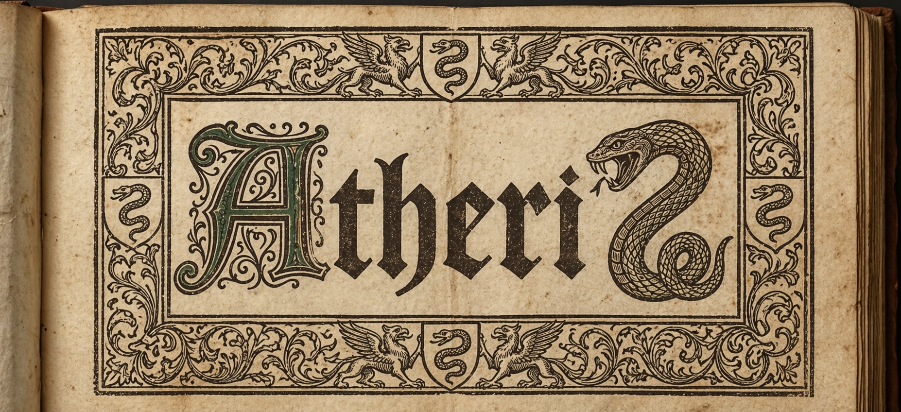

# AtheriZ

Discord server here: https://discord.gg/hb62HEBzQT

A text-based multiplayer game server.

This is an early draft and is not ready for production use, but it's getting close!

This has some code from Evennia, and is loosely based on the same ideas.

# Features

- multi-threaded with automatic thread-safety for immutable object attributes
- super fast object creation
- fast object deletion
- live map editing/room creation even with logged in players on the same map
- at_tick() for thousands of objects is feasible
- built-in web client based on xterm.js
- 3d coordinate room system
- optional ascii maps
- built-in pathfinding
- built-in door system
- built-in script system
- built-in tick system
- built-in time system with sunset, sunrise, and moon phases
- webclient has command history/completion, font size, etc. options

# Documentation

First version of the docs are up, view them here: [docs](docs/table_of_contents.md)

# TODO:

- ~~docs~~
- example game
- more tests (getting there!)
- ~~node hooks~~
- ~~scripts~~
- ~~tick system~~
- ~~time system~~
- ~~pathfinding~~
- ~~door stuff + ability for custom doors~~
- map tile highlight in game client
- ~~telnet~~
- follow and group system
- room nouns

https://github.com/user-attachments/assets/fbb712a6-5b65-469c-a20d-bb031e80a571

