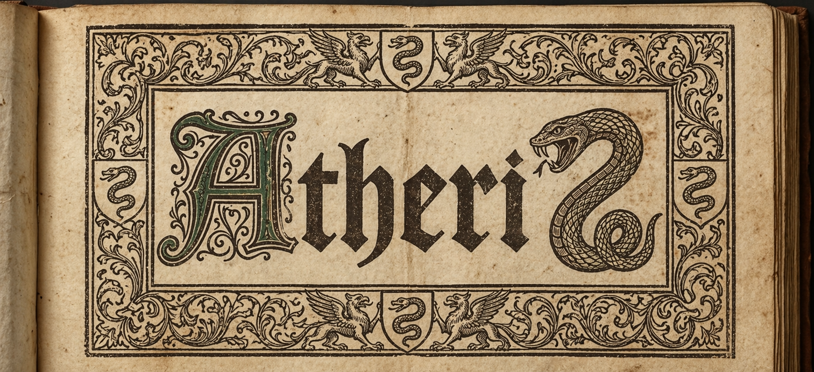

# AtheriZ

Discord server here: https://discord.gg/hb62HEBzQT

A text-based multiplayer game server.

This is an early draft and is not ready for production use, but it's getting close!

This has some code from Evennia, and is loosely based on the same ideas.

NOTE: This engine is meant to be used with Python 3.14 free-threaded (3.14t).

You *can* use it with regular Python builds, but you lose out on the whole reason I created this engine: better performance.

# Features

- Linux and Windows compatible, not tested on Mac yet
- screenreader friendly
- multi-threaded with automatic thread-safety for immutable object attributes
- super fast object creation
- fast object deletion
- live map editing/room creation even with logged in players on the same map
- at_tick() for thousands of objects is feasible
- built-in web client based on xterm.js with a split-screen dual pane view
- built-in telnet and websocket protocols
- built-in TLS: serve https/wss directly (single combined cert file suffices) or behind Caddy/nginx
- hot-reload game logic without restarting or dropping connections
- admin CLI (atheriz): account creation, start/stop/restart, hot reset
- accounts with multiple characters, bans, and per-IP connection limits
- 3d coordinate room system
- optional ascii maps
- built-in pathfinding
- follow and group commands
- built-in door system
- built-in script system
- menu engine for interactive prompts and dialogs
- built-in tick system
- built-in time system with sunset, sunrise, and moon phases
- webclient has command history/completion, font size, etc. options
- autosave via SQLite with dill serialization and dirty-flag gated checkpoints
- 3d sound propagation thru rooms, with per-room sound attenuation

# SSL/TLS

Serve the webclient over `https`/`wss` by setting `SSL_CERTFILE` in the game
folder's `settings.py` (or the `ATHERIZ_SSL_CERTFILE` env var):

```python
SSL_CERTFILE = "/path/to/yourgame.pem"
```

**Only the certificate is required if the cert file also embeds the private
key** (combined PEM). `SSL_KEYFILE` is optional — only for when the key is a
separate file. Restart the server after setting or renewing certs; the startup
log prints `SSL is enabled (cert: ...)` when TLS is on.

Prefer running behind a proxy instead? Caddy and nginx configs (automatic
certificates, WebSocket proxying, standard port 443) are in the docs:
[16 SSL/TLS & Reverse Proxying](docs/16_ssl_tls.md).

# Documentation

First version of the docs are up, view them here: [docs](docs/table_of_contents.md)

https://github.com/user-attachments/assets/fbb712a6-5b65-469c-a20d-bb031e80a571
